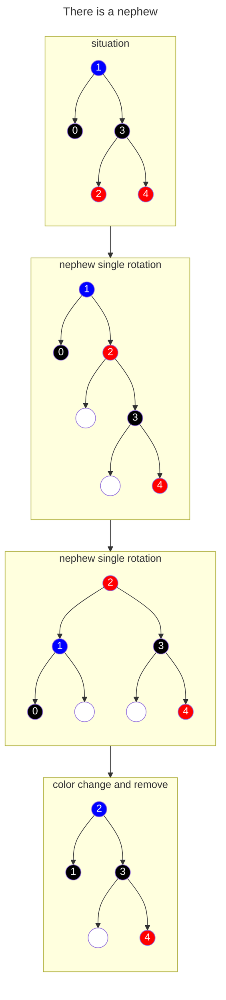

# Remove
## There is at least one subtree
Select the replacement node
If there is a right subtree, select the leftmost node of the right subtree
If there is a left subtree, select the rightmost node of the left subtree
Both is ok
If both are nil, assume the removed node is `child`, otherwise assume the replacement node is `child`
## Remove the 'child'
### The 'child' is red or root
just remove the node
### The 'child' is black
#### Brother is red

```mermaid
---
title: There is a gnephew
---
flowchart TB
    subgraph situation
    direction TB
    id1((0))
    id2((1))
    id3((2))
    id4((3))
    id5((4))
    id6((5))
    id7((6))
    id8((7))
    id9((8))
    style id1 fill:#000,color:#fff
    style id2 fill:#000,color:#fff
    style id3 fill:#f00,color:#fff
    style id4 fill:#000,color:#fff
    style id5 fill:#f00,color:#fff
    style id6 fill:#f00,color:#fff
    style id7 fill:#f00,color:#fff
    style id8 fill:#000,color:#fff
    style id9 fill:#f00,color:#fff
    id2 --> id1
    id2 --> id6
    id6 --> id4
    id6 --> id8
    id4 --> id3
    id4 --> id5
    id8 --> id7
    id8 --> id9
    end
    subgraph single [brother single rotation]
    direction TB
    id10((0))
    id11((1))
    id12((2))
    id13((3))
    id14((4))
    id15((5))
    id16((6))
    id17((7))
    id18((8))
    style id10 fill:#000,color:#fff
    style id11 fill:#000,color:#fff
    style id12 fill:#f00,color:#fff
    style id13 fill:#000,color:#fff
    style id14 fill:#f00,color:#fff
    style id15 fill:#f00,color:#fff
    style id16 fill:#f00,color:#fff
    style id17 fill:#000,color:#fff
    style id18 fill:#f00,color:#fff
    id11 --> id10
    id11 --> id13
    id13 --> id12
    id13 --> id14
    id15 --> id11
    id15 --> id17
    id17 --> id16
    id17 --> id18
    end
    subgraph single0 [gnephew single rotation]
    direction TB
    id19((0))
    id20((1))
    id21((2))
    id22((3))
    id23((4))
    id24((5))
    id25((6))
    id26((7))
    id27((8))
    id28((nil))
    id29((nil))
    style id19 fill:#000,color:#fff
    style id20 fill:#000,color:#fff
    style id21 fill:#f00,color:#fff
    style id22 fill:#000,color:#fff
    style id23 fill:#f00,color:#fff
    style id24 fill:#f00,color:#fff
    style id25 fill:#f00,color:#fff
    style id26 fill:#000,color:#fff
    style id27 fill:#f00,color:#fff
    style id28 fill:#fff,color:#fff
    style id29 fill:#fff,color:#fff
    id20 --> id19
    id20 --> id21
    id21 --> id28
    id21 --> id22
    id22 --> id29
    id22 --> id23
    id24 --> id20
    id24 --> id26
    id26 --> id25
    id26 --> id27
    end
    subgraph single1 [gnephew single rotation]
    direction TB
    id30((0))
    id31((1))
    id32((2))
    id33((3))
    id34((4))
    id35((5))
    id36((6))
    id37((7))
    id38((8))
    id39((nil))
    id40((nil))
    style id30 fill:#000,color:#fff
    style id31 fill:#000,color:#fff
    style id32 fill:#f00,color:#fff
    style id33 fill:#000,color:#fff
    style id34 fill:#f00,color:#fff
    style id35 fill:#f00,color:#fff
    style id36 fill:#f00,color:#fff
    style id37 fill:#000,color:#fff
    style id38 fill:#f00,color:#fff
    style id39 fill:#fff,color:#fff
    style id40 fill:#fff,color:#fff
    id31 --> id30
    id31 --> id39
    id32 --> id31
    id32 --> id33
    id33 --> id40
    id33 --> id34
    id35 --> id32
    id35 --> id37
    id37 --> id36
    id37 --> id38
    end
    subgraph color [color change and remove]
    direction TB
    id41((nil))
    id42((1))
    id43((2))
    id44((3))
    id45((4))
    id46((5))
    id47((6))
    id48((7))
    id49((8))
    style id41 fill:#fff,color:#fff
    style id42 fill:#000,color:#fff
    style id43 fill:#f00,color:#fff
    style id44 fill:#000,color:#fff
    style id45 fill:#f00,color:#fff
    style id46 fill:#000,color:#fff
    style id47 fill:#f00,color:#fff
    style id48 fill:#000,color:#fff
    style id49 fill:#f00,color:#fff
    id43 --> id42
    id43 --> id44
    id44 --> id41
    id44 --> id45
    id46 --> id43
    id46 --> id48
    id48 --> id47
    id48 --> id49
    end
    situation --> single
    single --> single0
    single0 --> single1
    single1 --> color
```

```mermaid
---
title: There is no gnephew
---
flowchart TB
    subgraph situation
    direction TB
    id1((0))
    id2((1))
    id3((nil))
    id4((3))
    id5((4))
    id6((5))
    id7((6))
    id8((7))
    id9((8))
    style id1 fill:#000,color:#fff
    style id2 fill:#000,color:#fff
    style id3 fill:#fff,color:#fff
    style id4 fill:#000,color:#fff
    style id5 fill:#f00,color:#fff
    style id6 fill:#f00,color:#fff
    style id7 fill:#f00,color:#fff
    style id8 fill:#000,color:#fff
    style id9 fill:#f00,color:#fff
    id2 --> id1
    id2 --> id6
    id6 --> id4
    id6 --> id8
    id4 --> id3
    id4 --> id5
    id8 --> id7
    id8 --> id9
    end
    subgraph single [brother single rotation]
    direction TB
    id10((0))
    id11((1))
    id12((nil))
    id13((3))
    id14((4))
    id15((5))
    id16((6))
    id17((7))
    id18((8))
    style id10 fill:#000,color:#fff
    style id11 fill:#000,color:#fff
    style id12 fill:#fff,color:#fff
    style id13 fill:#000,color:#fff
    style id14 fill:#f00,color:#fff
    style id15 fill:#f00,color:#fff
    style id16 fill:#f00,color:#fff
    style id17 fill:#000,color:#fff
    style id18 fill:#f00,color:#fff
    id11 --> id10
    id11 --> id13
    id13 --> id12
    id13 --> id14
    id15 --> id11
    id15 --> id17
    id17 --> id16
    id17 --> id18
    end
    subgraph single0 [nephew single rotation]
    direction TB
    id20((0))
    id21((1))
    id22((nil))
    id23((3))
    id24((4))
    id25((5))
    id26((6))
    id27((7))
    id28((8))
    style id20 fill:#000,color:#fff
    style id21 fill:#000,color:#fff
    style id22 fill:#fff,color:#fff
    style id23 fill:#000,color:#fff
    style id24 fill:#f00,color:#fff
    style id25 fill:#f00,color:#fff
    style id26 fill:#f00,color:#fff
    style id27 fill:#000,color:#fff
    style id28 fill:#f00,color:#fff
    id21 --> id22
    id21 --> id20
    id23 --> id21
    id23 --> id24
    id25 --> id23
    id25 --> id27
    id27 --> id26
    id27 --> id28
    end
    subgraph color [color change and remove]
    direction TB
    id31((1))
    id33((3))
    id34((4))
    id35((5))
    id36((6))
    id37((7))
    id38((8))
    style id31 fill:#f00,color:#fff
    style id33 fill:#000,color:#fff
    style id34 fill:#f00,color:#fff
    style id35 fill:#000,color:#fff
    style id36 fill:#f00,color:#fff
    style id37 fill:#000,color:#fff
    style id38 fill:#f00,color:#fff
    id33 --> id31
    id33 --> id34
    id35 --> id33
    id35 --> id37
    id37 --> id36
    id37 --> id38
    end
    situation --> single
    single --> single0
    single0 --> color
```

#### Brother is black
