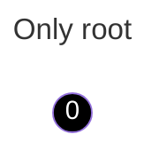
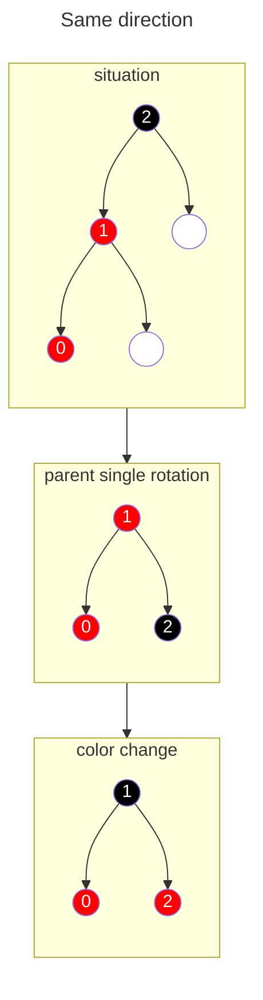
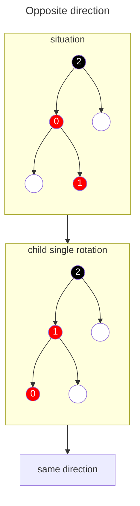
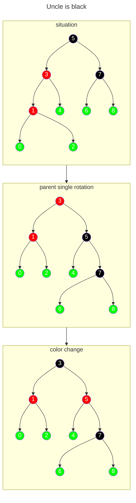
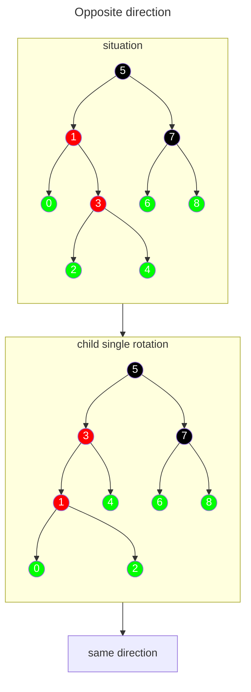
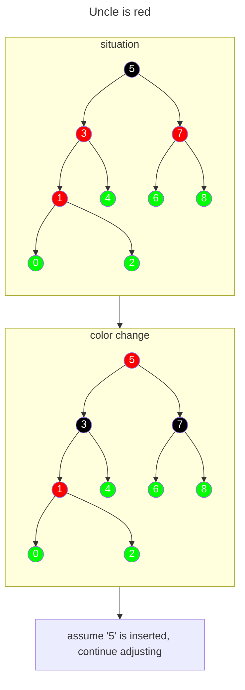
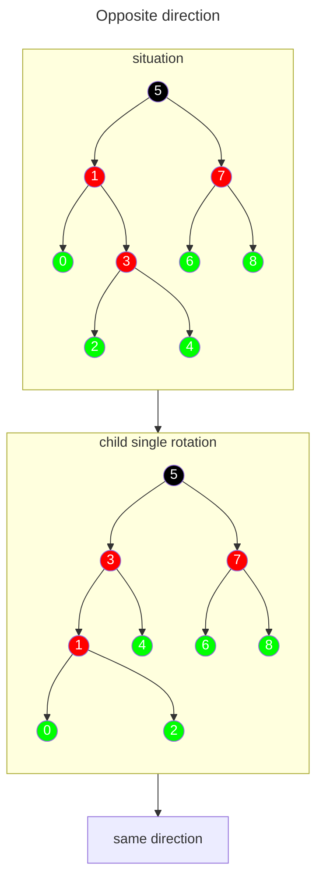

# Node name

# Insert
## Root
just change color to black

```mermaid
---
title: Only root
---
flowchart TB
    id1((0))
    style id1 fill:#000,color:#fff
```

## Parent is red
### Uncle is nil

```mermaid
---
title: Same direction
---
flowchart TB
    subgraph situation
    direction TB
    id1((0))
    id2((1))
    id3((nil))
    id4((2))
    id5((nil))
    style id1 fill:#f00,color:#fff
    style id2 fill:#f00,color:#fff
    style id3 fill:#fff,color:#fff
    style id4 fill:#000,color:#fff
    style id5 fill:#fff,color:#fff
    id2 --> id1
    id2 --> id3
    id4 --> id2
    id4 --> id5
    end
    subgraph single [parent single rotation]
    direction TB
    id6((0))
    id7((1))
    id8((2))
    style id6 fill:#f00,color:#fff
    style id7 fill:#f00,color:#fff
    style id8 fill:#000,color:#fff
    id7 --> id6
    id7 --> id8
    end
    subgraph color [color change]
    direction TB
    id9((0))
    id10((1))
    id11((2))
    style id9 fill:#f00,color:#fff
    style id10 fill:#000,color:#fff
    style id11 fill:#f00,color:#fff
    id10 --> id9
    id10 --> id11
    end
    situation --> single
    single --> color
```

```mermaid
---
title: Opposite direction
---
flowchart TB
    subgraph situation
    direction TB
    id1((nil))
    id2((0))
    id3((1))
    id4((2))
    id5((nil))
    style id1 fill:#fff,color:#fff
    style id2 fill:#f00,color:#fff
    style id3 fill:#f00,color:#fff
    style id4 fill:#000,color:#fff
    style id5 fill:#fff,color:#fff
    id2 --> id1
    id2 --> id3
    id4 --> id2
    id4 --> id5
    end
    subgraph single0 [child single rotation]
    direction TB
    id12((0))
    id13((1))
    id14((nil))
    id15((2))
    id16((nil))
    style id12 fill:#f00,color:#fff
    style id13 fill:#f00,color:#fff
    style id14 fill:#fff,color:#fff
    style id15 fill:#000,color:#fff
    style id16 fill:#fff,color:#fff
    id13 --> id12
    id13 --> id14
    id15 --> id13
    id15 --> id16
    end
    situation --> single0
    single0 --> sd[same direction]
```
### Uncle is black

```mermaid
---
title: Uncle is black
---
flowchart TB
    subgraph situation
    direction TB
    id1((0))
    id2((1))
    id3((2))
    id4((3))
    id5((4))
    id6((5))
    id7((6))
    id8((7))
    id9((8))
    style id1 fill:#0f0,color:#fff
    style id2 fill:#f00,color:#fff
    style id3 fill:#0f0,color:#fff
    style id4 fill:#f00,color:#fff
    style id5 fill:#0f0,color:#fff
    style id6 fill:#000,color:#fff
    style id7 fill:#0f0,color:#fff
    style id8 fill:#000,color:#fff
    style id9 fill:#0f0,color:#fff
    id2 --> id1
    id2 --> id3
    id4 --> id2
    id4 --> id5
    id6 --> id4
    id6 --> id8
    id8 --> id7
    id8 --> id9
    end
    subgraph single [parent single rotation]
    direction TB
    id10((0))
    id11((1))
    id12((2))
    id13((3))
    id14((4))
    id15((5))
    id16((6))
    id17((7))
    id18((8))
    style id10 fill:#0f0,color:#fff
    style id11 fill:#f00,color:#fff
    style id12 fill:#0f0,color:#fff
    style id13 fill:#f00,color:#fff
    style id14 fill:#0f0,color:#fff
    style id15 fill:#000,color:#fff
    style id16 fill:#0f0,color:#fff
    style id17 fill:#000,color:#fff
    style id18 fill:#0f0,color:#fff
    id11 --> id10
    id11 --> id12
    id13 --> id11
    id13 --> id15
    id15 --> id14
    id15 --> id17
    id17 --> id16
    id17 --> id18
    end
    subgraph color [color change]
    direction TB
    id19((0))
    id20((1))
    id21((2))
    id22((3))
    id23((4))
    id24((5))
    id25((6))
    id26((7))
    id27((8))
    style id19 fill:#0f0,color:#fff
    style id20 fill:#f00,color:#fff
    style id21 fill:#0f0,color:#fff
    style id22 fill:#000,color:#fff
    style id23 fill:#0f0,color:#fff
    style id24 fill:#f00,color:#fff
    style id25 fill:#0f0,color:#fff
    style id26 fill:#000,color:#fff
    style id27 fill:#0f0,color:#fff
    id20 --> id19
    id20 --> id21
    id22 --> id20
    id22 --> id24
    id24 --> id23
    id24 --> id26
    id26 --> id25
    id26 --> id27
    end
    situation --> single
    single --> color
```

```mermaid
---
title: Opposite direction
---
flowchart TB
    subgraph situation
    direction TB
    id1((0))
    id2((1))
    id3((2))
    id4((3))
    id5((4))
    id6((5))
    id7((6))
    id8((7))
    id9((8))
    style id1 fill:#0f0,color:#fff
    style id2 fill:#f00,color:#fff
    style id3 fill:#0f0,color:#fff
    style id4 fill:#f00,color:#fff
    style id5 fill:#0f0,color:#fff
    style id6 fill:#000,color:#fff
    style id7 fill:#0f0,color:#fff
    style id8 fill:#000,color:#fff
    style id9 fill:#0f0,color:#fff
    id2 --> id1
    id2 --> id4
    id4 --> id3
    id4 --> id5
    id6 --> id2
    id6 --> id8
    id8 --> id7
    id8 --> id9
    end
    subgraph single0 [child single rotation]
    direction TB
    id10((0))
    id11((1))
    id12((2))
    id13((3))
    id14((4))
    id15((5))
    id16((6))
    id17((7))
    id18((8))
    style id10 fill:#0f0,color:#fff
    style id11 fill:#f00,color:#fff
    style id12 fill:#0f0,color:#fff
    style id13 fill:#f00,color:#fff
    style id14 fill:#0f0,color:#fff
    style id15 fill:#000,color:#fff
    style id16 fill:#0f0,color:#fff
    style id17 fill:#000,color:#fff
    style id18 fill:#0f0,color:#fff
    id11 --> id10
    id11 --> id12
    id13 --> id11
    id13 --> id14
    id15 --> id13
    id15 --> id17
    id17 --> id16
    id17 --> id18
    end
    situation --> single0
    single0 --> sd[same direction]
```
### Uncle is red

```mermaid
---
title: Uncle is red
---
flowchart TB
    subgraph situation
    direction TB
    id1((0))
    id2((1))
    id3((2))
    id4((3))
    id5((4))
    id6((5))
    id7((6))
    id8((7))
    id9((8))
    style id1 fill:#0f0,color:#fff
    style id2 fill:#f00,color:#fff
    style id3 fill:#0f0,color:#fff
    style id4 fill:#f00,color:#fff
    style id5 fill:#0f0,color:#fff
    style id6 fill:#000,color:#fff
    style id7 fill:#0f0,color:#fff
    style id8 fill:#f00,color:#fff
    style id9 fill:#0f0,color:#fff
    id2 --> id1
    id2 --> id3
    id4 --> id2
    id4 --> id5
    id6 --> id4
    id6 --> id8
    id8 --> id7
    id8 --> id9
    end
    subgraph color [color change]
    direction TB
    id10((0))
    id11((1))
    id12((2))
    id13((3))
    id14((4))
    id15((5))
    id16((6))
    id17((7))
    id18((8))
    style id10 fill:#0f0,color:#fff
    style id11 fill:#f00,color:#fff
    style id12 fill:#0f0,color:#fff
    style id13 fill:#000,color:#fff
    style id14 fill:#0f0,color:#fff
    style id15 fill:#f00,color:#fff
    style id16 fill:#0f0,color:#fff
    style id17 fill:#000,color:#fff
    style id18 fill:#0f0,color:#fff
    id11 --> id10
    id11 --> id12
    id13 --> id11
    id13 --> id14
    id15 --> id13
    id15 --> id17
    id17 --> id16
    id17 --> id18
    end
    situation --> color
    color --> sd[assume '5' is inserted, continue adjusting]
```

```mermaid
---
title: Opposite direction
---
flowchart TB
    subgraph situation
    direction TB
    id1((0))
    id2((1))
    id3((2))
    id4((3))
    id5((4))
    id6((5))
    id7((6))
    id8((7))
    id9((8))
    style id1 fill:#0f0,color:#fff
    style id2 fill:#f00,color:#fff
    style id3 fill:#0f0,color:#fff
    style id4 fill:#f00,color:#fff
    style id5 fill:#0f0,color:#fff
    style id6 fill:#000,color:#fff
    style id7 fill:#0f0,color:#fff
    style id8 fill:#f00,color:#fff
    style id9 fill:#0f0,color:#fff
    id2 --> id1
    id2 --> id4
    id4 --> id3
    id4 --> id5
    id6 --> id2
    id6 --> id8
    id8 --> id7
    id8 --> id9
    end
    subgraph single0 [child single rotation]
    direction TB
    id10((0))
    id11((1))
    id12((2))
    id13((3))
    id14((4))
    id15((5))
    id16((6))
    id17((7))
    id18((8))
    style id10 fill:#0f0,color:#fff
    style id11 fill:#f00,color:#fff
    style id12 fill:#0f0,color:#fff
    style id13 fill:#f00,color:#fff
    style id14 fill:#0f0,color:#fff
    style id15 fill:#000,color:#fff
    style id16 fill:#0f0,color:#fff
    style id17 fill:#f00,color:#fff
    style id18 fill:#0f0,color:#fff
    id11 --> id10
    id11 --> id12
    id13 --> id11
    id13 --> id14
    id15 --> id13
    id15 --> id17
    id17 --> id16
    id17 --> id18
    end
    situation --> single0
    single0 --> sd[same direction]
```